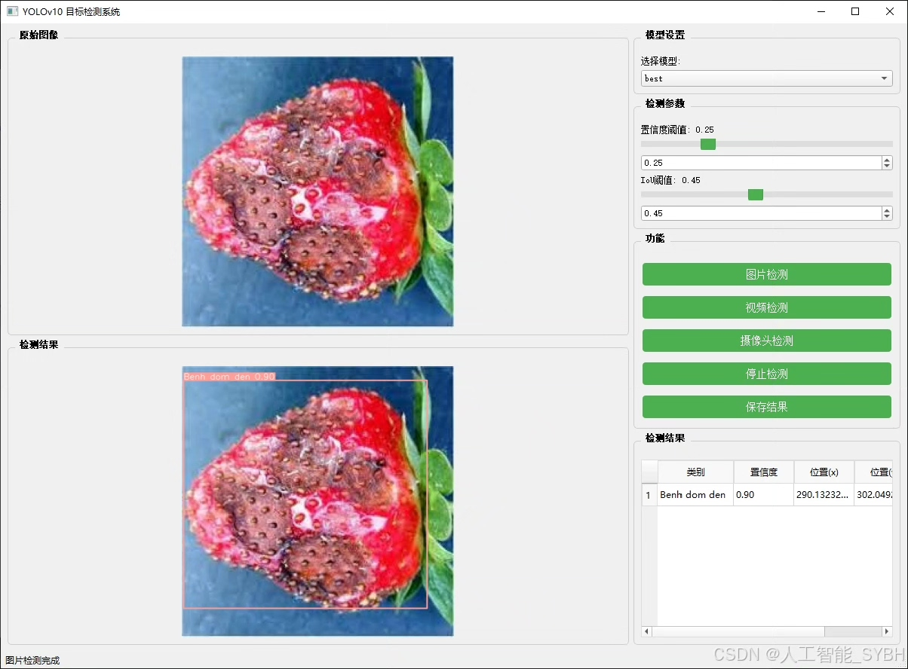
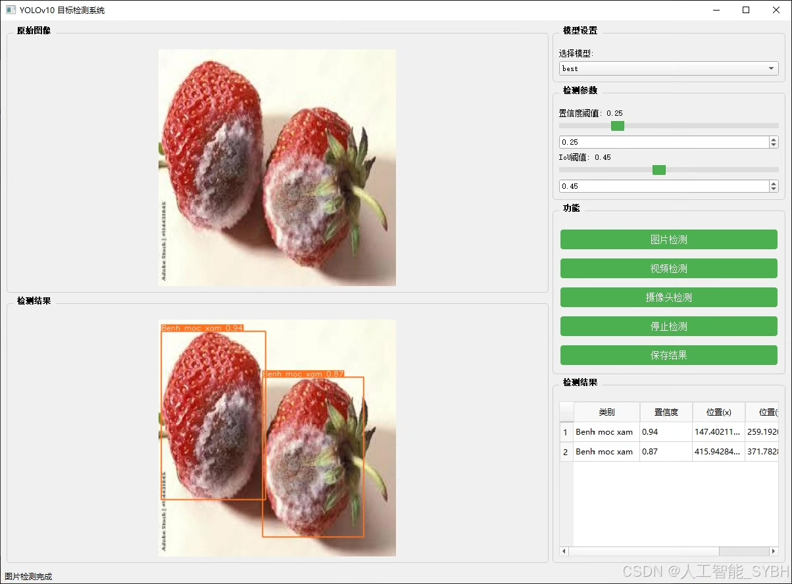
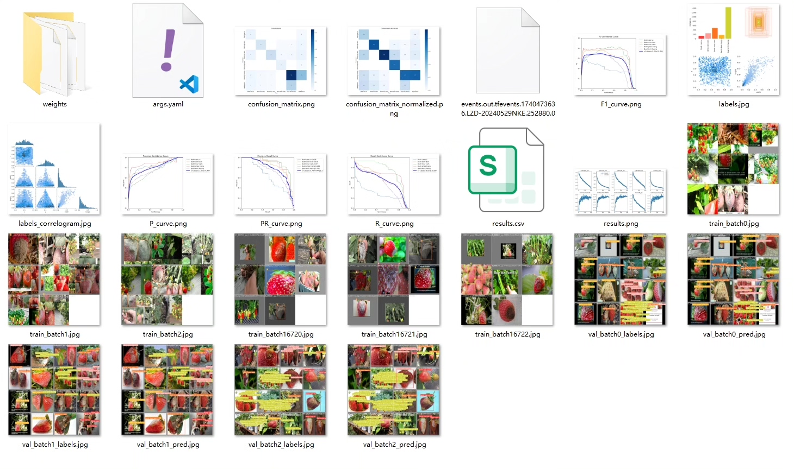
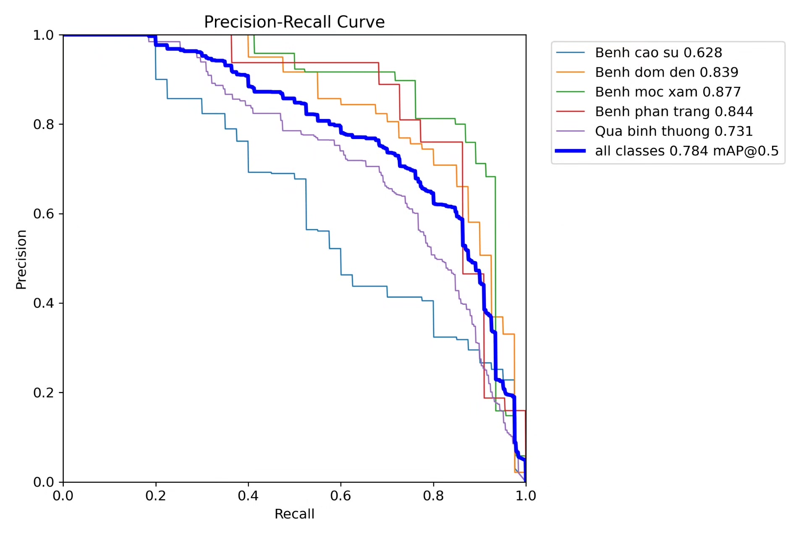
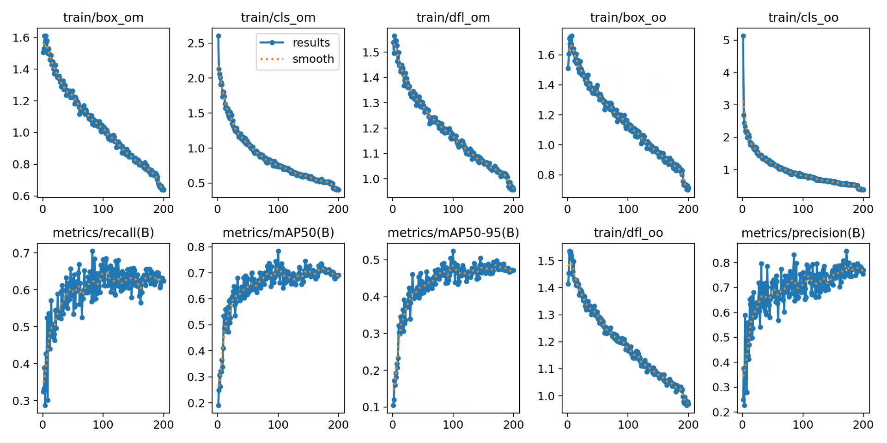
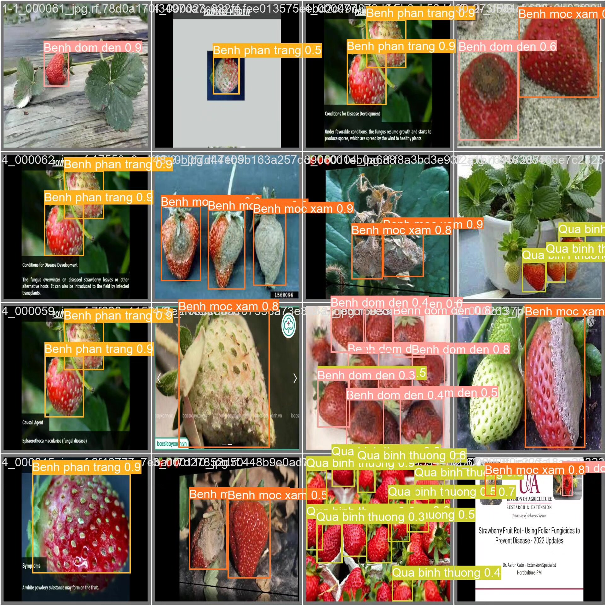
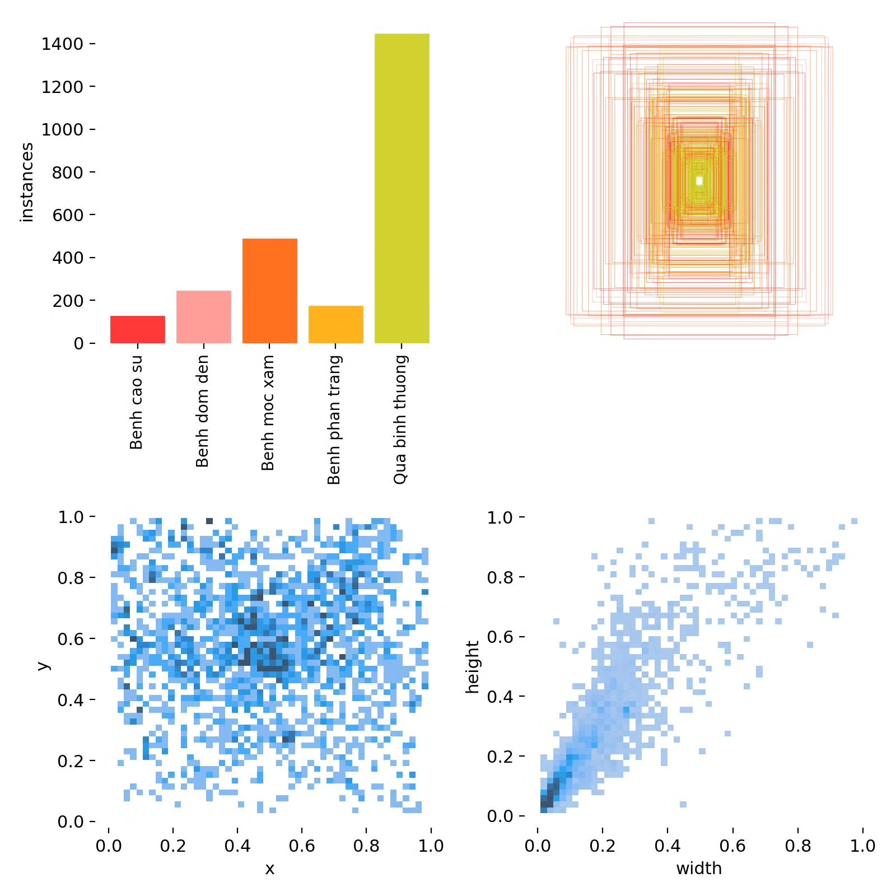
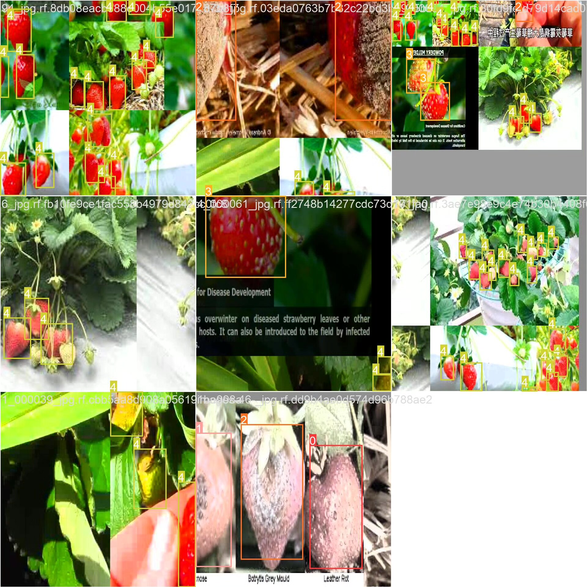

# Based on deep learning YOLOv10, a strawberry fruit disease detection system (YOLOv

## Body

Based on deep learning YOLOv10, a strawberry fruit disease detection system (YOLOv10+YOLO dataset + UI interface + Python project source code + model)

Strawberries are a high-value fruit crop, but they can be easily attacked by various diseases during the planting process, such as Benh cao su (rubber rot), Benh dom den (black spot disease), Benh moc xam (gray mold disease), and Benh phan trang (powdery mildew). These diseases can severely affect the yield and quality of strawberries. Traditional disease detection methods rely on manual observation, which is inefficient and prone to missed detections. Based on deep learning target detection technology, strawberry fruit diseases can be automatically identified, helping growers take timely preventive measures and reduce economic losses.

Our company's products have been granted the official commercial license certification from YOLO.

We provide after-sales service.

After payment, we will provide WeChat ID for any questions you may have.

Environmental configuration: We will provide a tutorial on how to configure the environment, and WeChat will provide answers to your questions.

Remote installation service: If you need remote configuration, an additional fee of 69 is required.
If the configuration fails, all fees will be refunded (only the installation fee is refundable for older computers).

Retraining dataset: After configuring the environment, you can train on your own computer.
If you need us to retrain, just pay 69 plus computing power fees (2.5 yuan/hour).

Full after-sales service

## Images

## Payment

Here is a pay link on Stripe ( https://buy.stripe.com/3cs8yP7sY87d0vu9AB ). Please contact me lonlonago@foxmail.com after funding $89, and I will send you a complete data files , thank you!

